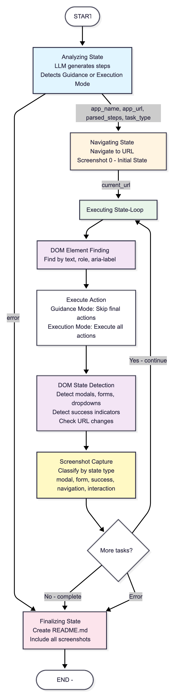

# Agent B - Runtime AI Web App Workflow Executor with Visual Guides

Agent B is an AI-powered system that automatically executes web application tasks and generates step-by-step visual guides with UI screenshots. It intelligently analyzes natural language tasks, detects the target web app, performs the workflow using browser automation to interact with UI elements, and creates comprehensive documentation with screenshots.

Agent B handles two types of tasks:
- **Guidance Tasks** (questions): Demonstrates how to perform workflows (e.g., "How do I create a project in Linear?")
- **Execution Tasks** (commands): Actually performs the actions (e.g., "Create a project in Linear named 'Project1'")

**Supports**: Linear, Notion, Asana, and any web app (configurable via config.py)

## Architecture Diagram



The diagram above illustrates the complete workflow of Agent B, from task analysis through execution to documentation generation. It shows:
- **Analyzing State**: LLM generates steps and detects task type (Guidance vs Execution mode)
- **Navigating State**: Browser navigation to the target application
- **Executing State Loop**: DOM element finding, action execution, state detection, and screenshot capture
- **Finalizing State**: Documentation generation with captured screenshots

## How It Works

1. **Task Analysis**: Agent B analyzes the task using an LLM to:
   - Extract the app name from the task (e.g., "Linear", "Notion")
   - Detect the task type (guidance/question vs execution/command) based on question indicators like "how do i", "how to",  "create" etc.
2. **URL Resolution**: Fetches the base URL from `config.py` file (from `APP_URLS` dictionary)
3. **Step Planning**: Uses an LLM planner to break the task into step-by-step actionable points
4. **Browser Automation**: Uses Playwright to navigate and interact with the app
5. **State Detection**: Detects UI changes (URL changes, modals, forms, toasts) after each action
6. **Screenshot Capture**: Takes full-page screenshots at each state change
7. **Documentation**: Creates `README.md` with step-by-step documentation and screenshot references

## URL Access Strategy

**How Agent B accesses URLs:**

1. **Initial URL Only**: Agent B determines the app name from task text, then fetches the base URL from `config.py` (e.g., "Linear" → `APP_URLS["LINEAR"]` → `https://linear.app/login`)
2. **Navigate Once**: Goes to that base URL using Playwright
3. **UI-Based Navigation**: After that, ALL navigation is through UI interactions:
   - Clicking buttons (even if they open modals with no URLs)
   - Filling forms (that may not change URLs)
   - Interacting with dropdowns/overlays
4. **State Capture**: Screenshots are taken at each interaction, regardless of whether the URL changed

**Key Insight**: Many important UI states (modals, forms, dropdowns) don't have URLs. Agent B captures them by:
- **DOM Change Detection**: Monitors the DOM for state changes using multiple detection strategies:
  - **Modals/Dialogs**: Detects elements with `role="dialog"`, class names containing "Modal", "Dialog", "Overlay", or "Popup"
  - **Forms**: Detects visible `<form>` elements and elements with `role="form"`
  - **Dropdowns/Menus**: Detects elements with `role="menu"`, `role="listbox"`, or class names containing "Dropdown" or "Menu"
  - **Success Indicators**: Detects text content containing "success", "created", "saved", "completed", or "done"
  - **Loading States**: Detects loading spinners and elements with `aria-busy="true"`
- **State Signature Tracking**: Creates a unique signature for each UI state to identify when the state actually changes (not just on every interaction)
- **Screenshot Capture**: Takes screenshots at each detected state change, regardless of whether the URL changed
- **Non-URL Navigation**: Fully supports UI interactions that don't change the URL (modals, overlays, inline forms)

## Setup

```bash
# Install dependencies
pip install -r requirements.txt
playwright install chromium

# Set up environment variables
# Create a .env file in the root directory and add the following:

# API Keys
GOOGLE_API_KEY=your_google_api_key_here
LANGSMITH_API_KEY=your_langsmith_api_key_here

# LangSmith Configuration
LANGSMITH_PROJECT=your_project_name
LANGSMITH_TRACING=true

# Browser Settings
HEADLESS=false


# Run
python main.py
```

## Configuration

### App URLs

App URLs are pre-configured in `src/utils/config.py` in the `APP_URLS` dictionary:

# In src/utils/config.py
APP_URLS = {
    "LINEAR": "https://linear.app/login",
    "NOTION": "https://www.notion.so/login",
    "ASANA": "https://app.asana.com/login",
}To add more web apps, simply add them to this dictionary. The system also has smart fallback logic that can automatically generate URLs for common apps based on their names (e.g., "Trello" → `https://trello.com/login`).

### Running Tasks

Tasks are entered interactively at runtime when you run `python main.py`. The system will prompt you to enter a task, which can be either:

**Guidance Tasks** (Questions - demonstrates how to do something):
- "How do I create a project in Linear?"
- "How to see my tasks in Asana?"
- "How to see my issues in Linear?"

**Execution Tasks** (Commands - actually performs the action):
- "Create a project in Linear named 'Project1'"
- "Filter the issues with assignee 'Hardik Setia' in Linear"

The system automatically:
- Detects the app name from the task text
- Recognizes whether it's a guidance (question) or execution (command) task
- Fetches the corresponding URL from `config.py` (from `APP_URLS` dictionary, with smart fallback)
- Works with any web app (add to `APP_URLS` in `config.py` or rely on automatic URL generation)

## Output Structure

When you run Agent B, outputs are saved to the `outputs/datasets/` directory. **Note**: This directory is gitignored and not committed to the repository.

```
outputs/datasets/
├── linear/
│   └── create_project_in_linear/
│       ├── step_0_app.png
│       ├── step_1_open_dashboard.png
│       ├── step_2_click_create_button.png
│       ├── step_3_fill_form.png
│       ├── step_4_success_modal.png
│       └── README.md
```

**Example Outputs**: Check the `example_outputs/` directory in this repository to see example workflow outputs and screenshot documentation.

## Architecture

- **Agent B**: Single agent that handles everything for any web app
- **LangGraph**: Workflow orchestration with nodes and edges
- **Gemini 2.5 Flash**: Task analysis, app detection, step planning, and action determination
- **LangSmith**: Full observability and tracing (all operations are traced)
- **Playwright**: Browser automation
- **State Detection**: Detects UI changes by monitoring DOM changes (modals, forms, dropdowns, success indicators) regardless of URL
- **Runtime Login**: Prompts for credentials at runtime when login is required
- **Dynamic App Detection**: Extracts app name from task and fetches URL from `config.py`

See the [Architecture Diagram](#architecture-diagram) above for a visual representation of the complete workflow.

## LangSmith Integration

All workflow steps are automatically traced in LangSmith. View traces at:
https://smith.langchain.com


## Example Workflow

For task: "How do I create a project in Linear?"

1. Agent B extracts app name: "Linear" from task text
2. Fetches URL from `config.py`: `APP_URLS["LINEAR"]` → `https://linear.app/login`
3. Analyzes task and creates step-by-step plan using LLM
4. Navigates to `https://linear.app/login` (captures initial screenshot as step 0)
5. **If login required**: Prompts for manual login (user completes in browser)
6. Executes each step:
   - Step 1: Finds and clicks "Create Project" button (modal opens - screenshot captured)
   - Step 2: Fills in project name (form visible - screenshot captured)
   - Step 3: Clicks "Create" (success state - screenshot captured)
7. Creates `README.md` with step-by-step documentation and screenshot references

Each screenshot captures the UI state, even when the URL doesn't change.

## Login

When a web app requires login, the system will:
1. Detect login requirement automatically
2. Pause and wait for you to log in manually in the browser window
3. Continue workflow after you press Enter

This works for any web app (Linear, Notion, Asana, etc.)

